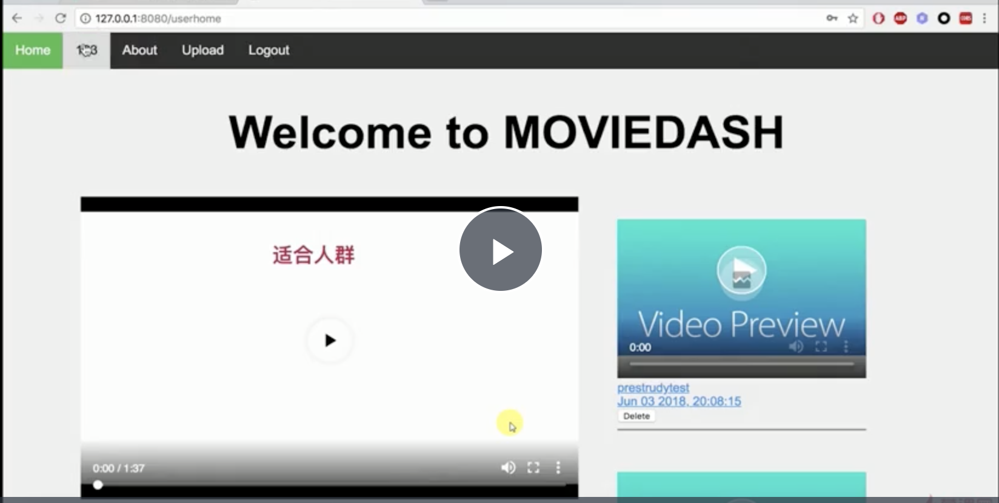

## video-sharing platform

### REST接口设计
REST代表含义：Resource Representational State Transfer。   

Server提供的RESTful API中，URL中只使用名词来指定资源，原则上不使用动词。“资源”是REST架构或者说整个网络处理的核心。
URL定位资源，用HTTP动词（GET,POST,DELETE,DETC）描述操作。

数据库设计

用HTTP协议里的动词来实现资源的添加，修改，删除等操作。即通过HTTP动词来实现资源的状态扭转

用HTTP作为通信协议，JSON作为数据格式。

##预期功能

断点续传