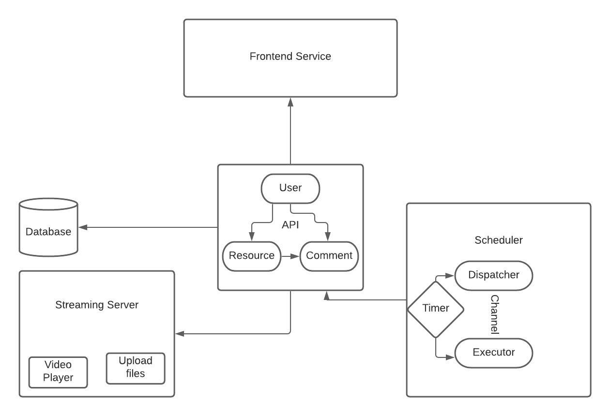

## Share+: video-sharing platform
General:
User can watch/upload/download videos from the website. They can also make comments on the videos. The final target of this project is to build a community like TikTok.

####Simple and efficient live broadcast server:
- Very simple to install and use;
- Pure Golang, high performance, and cross-platform;
- Supports commonly used transmission protocols, file formats, and encoding formats;

#### Supported transport protocols
- HLS
- HTTP-FLV

### Design Graph

#### API Design
Using HTTP Protocol to fulfill the operation on resource.
Three types of APIs:
- USER API: return states of each user.
- RESOURCE API: returns the states of video(s).
- COMMENT API: returns all the comments under one specific video/

#### Streaming Server Design
Prerequisite:
[bitbucket](https://godoc.org/github.com/DavidCai1993/token-bucket)

- UDP protocol to implement file uploading
- Token Bucket to control rate limit

#### Scheduler Design
[**Channels are the pipes that connect concurrent goroutines.**](https://tour.golang.org/concurrency/2)

- Asynchronous Delete
- Producer-Consumer Model
- Timer: Run and Stop

## Future goals

Cloud native Optimization

